# Browser Technologies
## Opdracht 1.2 - Fork je OBA
Hoe zit het eigenlijk met Progressive Enhancement van je OBA opdracht? Waarschijnlijk kan daar wel het één en ander aan verbeterd worden, dat ding is immers in een week in elkaar gehackt!


**standaard browse ik in chrome:**

#### Images
De afbeeldingen op mijn pagina zijn de covers van de boeken en zijn niet zo heel belangrijk, omdat  de titel en de auteur al vermeld worden. Ik heb daarom de alt tag leeg gelaten.

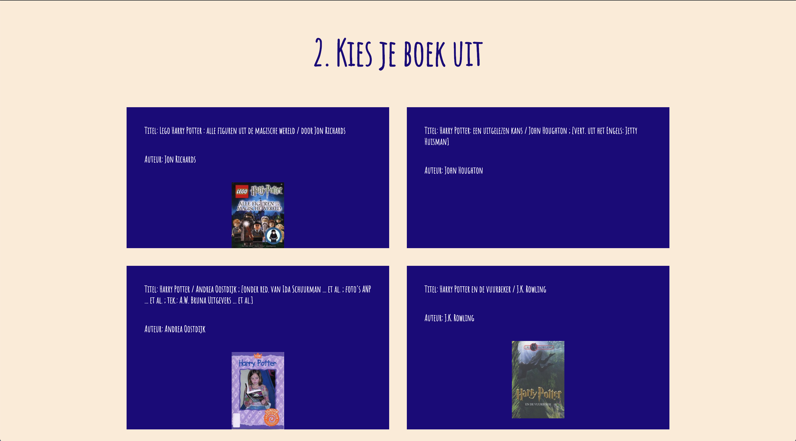

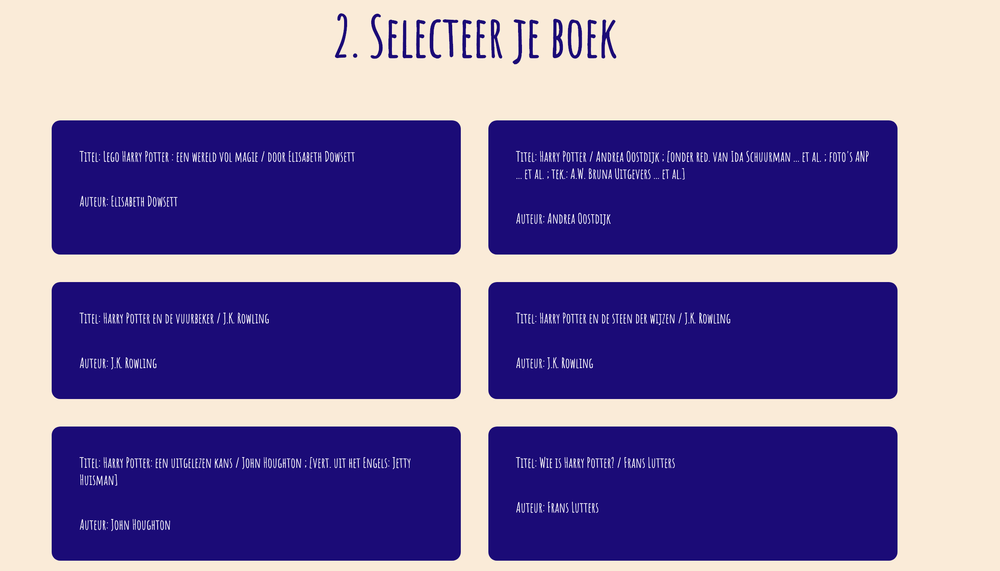


#### Custom Fonts
Ik maak gebruik van een custom font, ik had nog geen fallback fonts toegevoegd. Dus als je t font niet inlaad, dan werd ’t times new roman. Nu heb ik ’t zo aangepast, dat mijn laatste fallback een sans-serif font is. De tekst erboven is een svg, dus die wordt alsnog gewoon ingeladen.

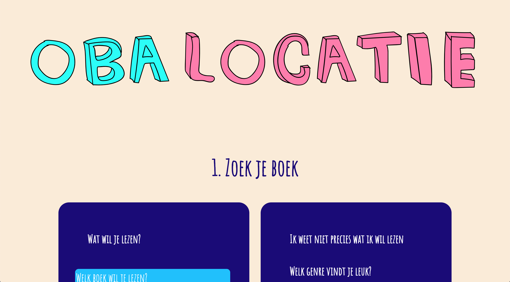

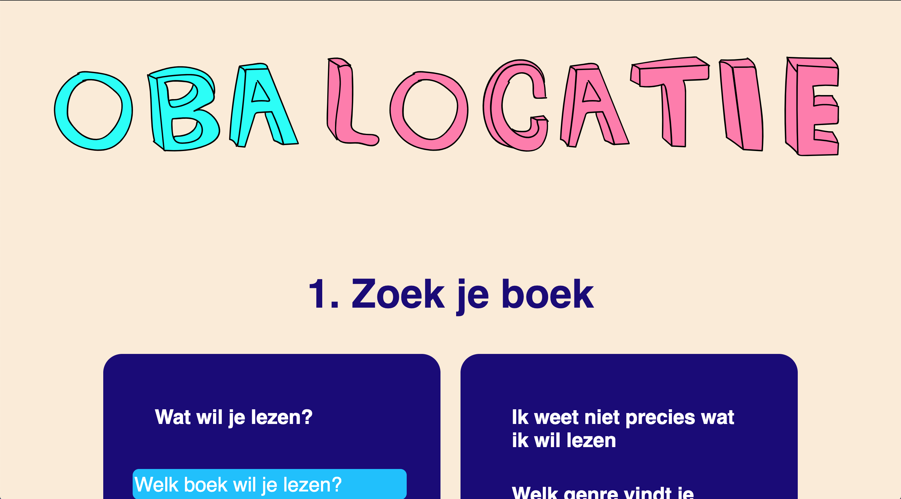

#### Kleur
Met de colorblindly browser extension, heb ik mijn kleur getest. Het contrast is opzicht goed, het enige waar ik tegen kwam was de witte tekst op licht blauw geen goed contrast is. Dus moet ik daar het contrast aanpassen.

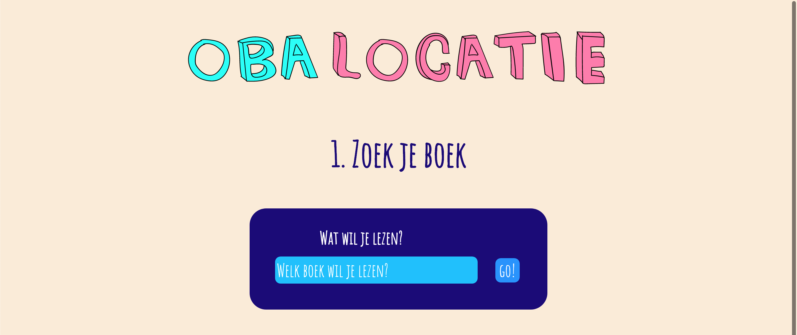
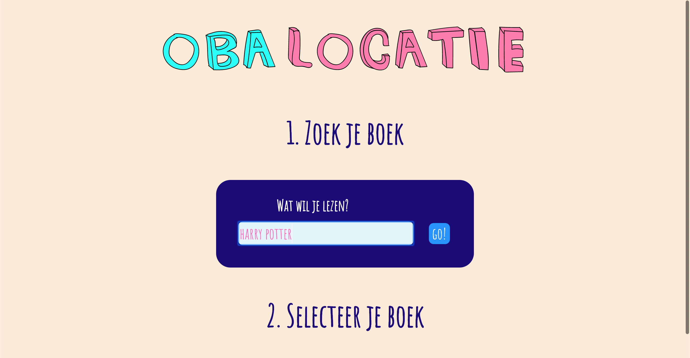

heb daarom het blauw van de button aangepast om te laten zien, dat dat al wat beter leesbaar is.

en dit is trouwens wat de audit zei:
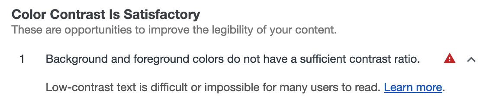

#### Breedband
Ik heb gemerkt dat als de pagina nog niet klaar is met laden dat je dan nog niks kan doen kwa interactie, omdat de js nog niet klaar is met laden. Dit zou je kunnen oplossen door je scripttag beneden aan de pagina te zetten. Ook heb ik gebruik gemaakt van templating in js en wordt de tekst niet als eerste geladen.  Voor de afbeeldingen zou je kunnen aangeven dat hij een bepaalde width en een height heeft, zodat de pagina niet verspringt met inladen.

#### Geen Muis/Trackpad
Ik begin goed, input veld, buttons zijn makkelijk te bereiken met alleen je tab en pijltjes. Maar dan als je een boek hebt gezocht, kan je geen boek selecteren. Dit omdat het div’jes zijn en ik er beter misschien beter radiobuttons van maken kan.

#### Geen Javascript
Deze applicatie is volledig client side, dus je kan niks meer en bepaalde tekst wordt niet meer ingeladen. Om dit op te lossen zou je het serverside kunnen maken en de clientside javascript alleen gebruiken als enhancement.


#### Geen Cookies & localstorage
De opa wrapper maakt gebruik van local storage en werkt dan niet meer als het uitstaat. Dit zou ik kunnen oplossen door een melding te laten zien, wanneer de gebruiker cookies en localstorage uit heeft staan. Of er voor zorgen dat als de cookies en localstorage uit staan, dat het op de server wordt opgeslagen.

#### Screenreader
Boven aan begin ik met een grote svg, die titel moet voorstellen. Nou is het dus een svg en kan een screenreader, die dus niet uitlezen. Maar gelukkig ben ik er door dit artikel [Accessible SVGs | CSS-Tricks](https://css-tricks.com/accessible-svgs/) achter gekomen, dat je een titel tag kunt gebruiken bij je inline svg’s, zo kan het alsnog worden voorgelezen. 

Maar wat er dan gebeurd is dat hij ook nog de rest van de code gaat oplezen. Ik heb gelezen dat als je role=“img” toevoegt en dan met aria labels werkt, je dat kan oplossen. Bij dat voorbeeld werkt het ook, maar bij mij krijg ik dan te horen: h1 en img. Andere oplossing is dus geen svg's gebruiken voor tekst.

## Device lab

#### Windows tablet:
- internet explorer 11.0 on windows rt 8.1

import modules werken niet, dus krijg de zelfde ervaring als wanneer je je js uit zet in chrome.

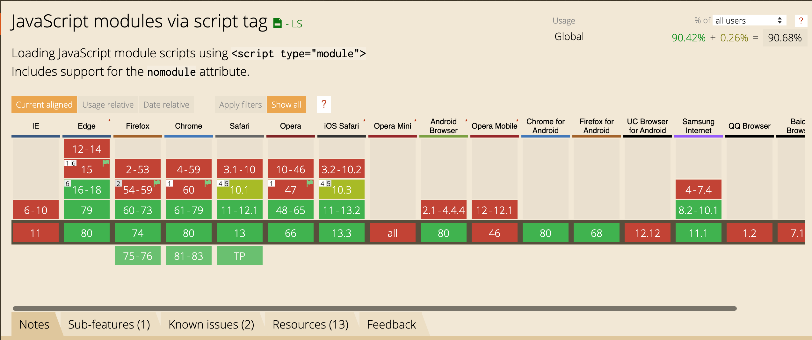

oplossing is om alle componenten in je build samen te voegen en minify te gebruiken en babel gebruiken

#### Huawei:
- Android browser on a huawei ascend y300 running android 4.11

niet kunnen testen, apparaat gaf aan dat GitHub geen veilige site is

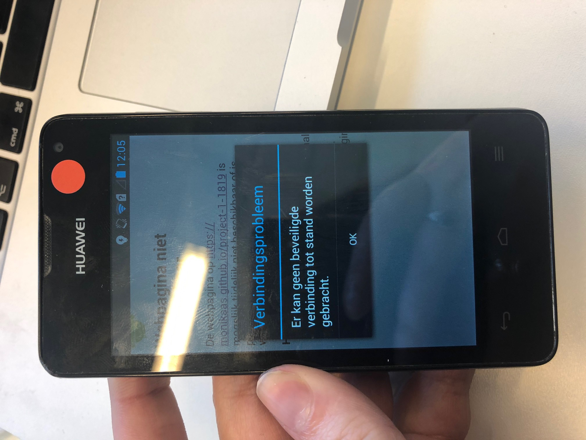

#### apple iPod touch:
- safari on apple iPod touch, running iOS 5.01

zelfde als bij de huawei


## Browsers

#### firefox:
in de oba wrapper wordt regex gebruikt, wat niet werkt.

Regex expression werkt niet
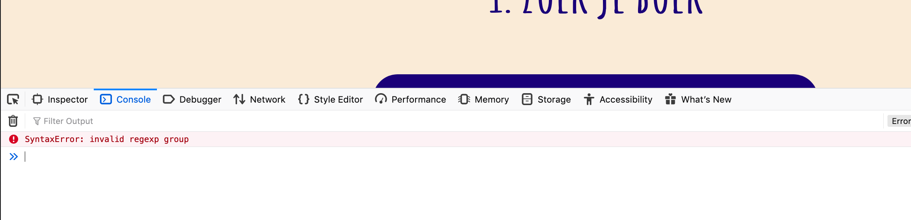


komt door lookbehind expression (not currently supported in Firefox)
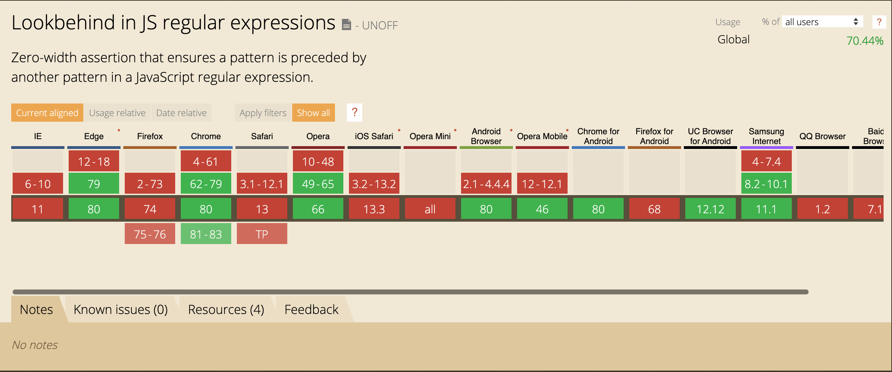

tekst in input veld heeft een andere kleur:
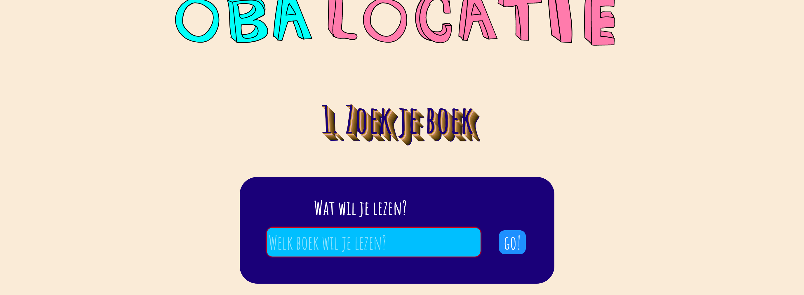


en firefox geeft een rode border om een required input veld,
zo kan je het oplossen:
```
input:required {
    box-shadow: none;
}
```


#### brave:
Bij brave heb ik niet echt iets anders gemerkt, alles werkte gewoon goed en zag er ook hetzelfde uit als bij chrome.
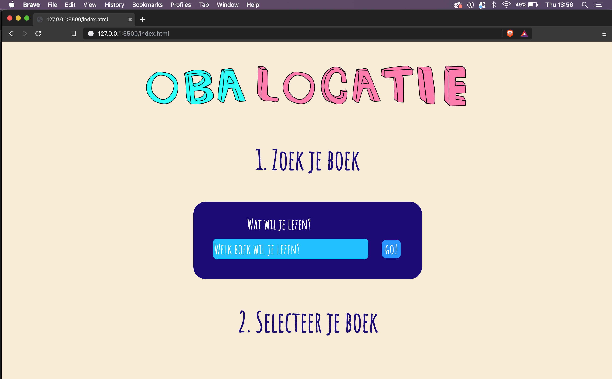


#### safari 12.0.3:
Svg’s worden anders ingekleurd & font heeft een andere dikte.

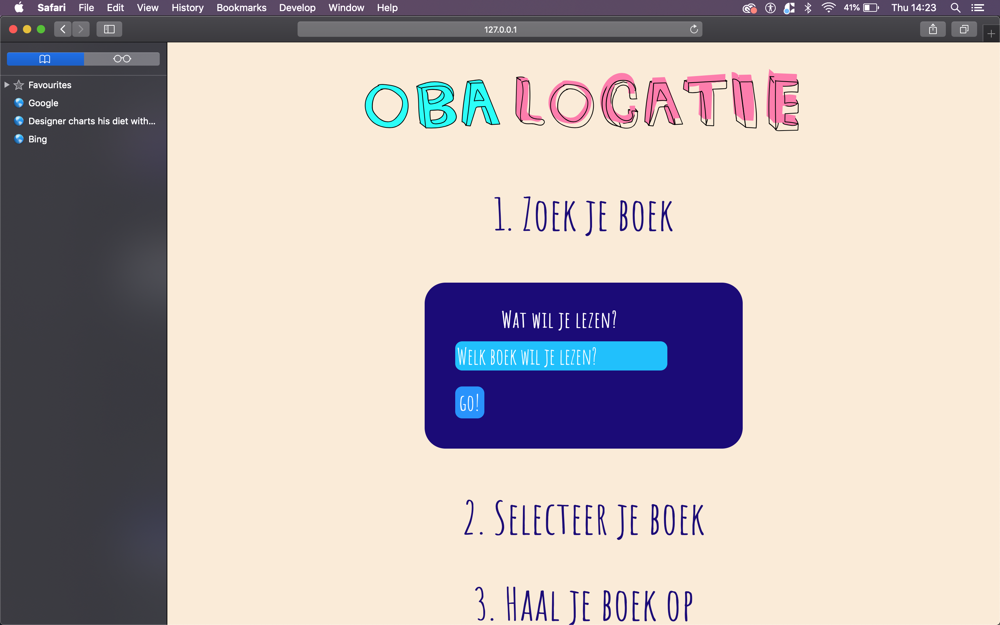


