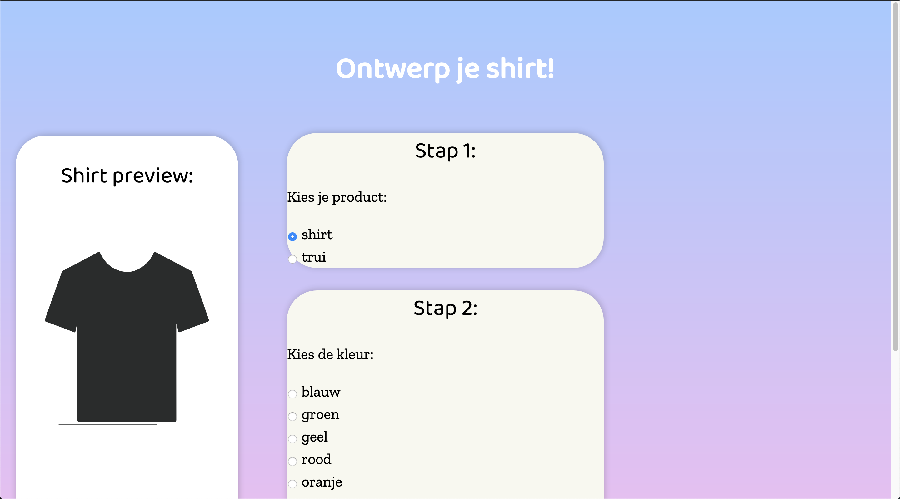
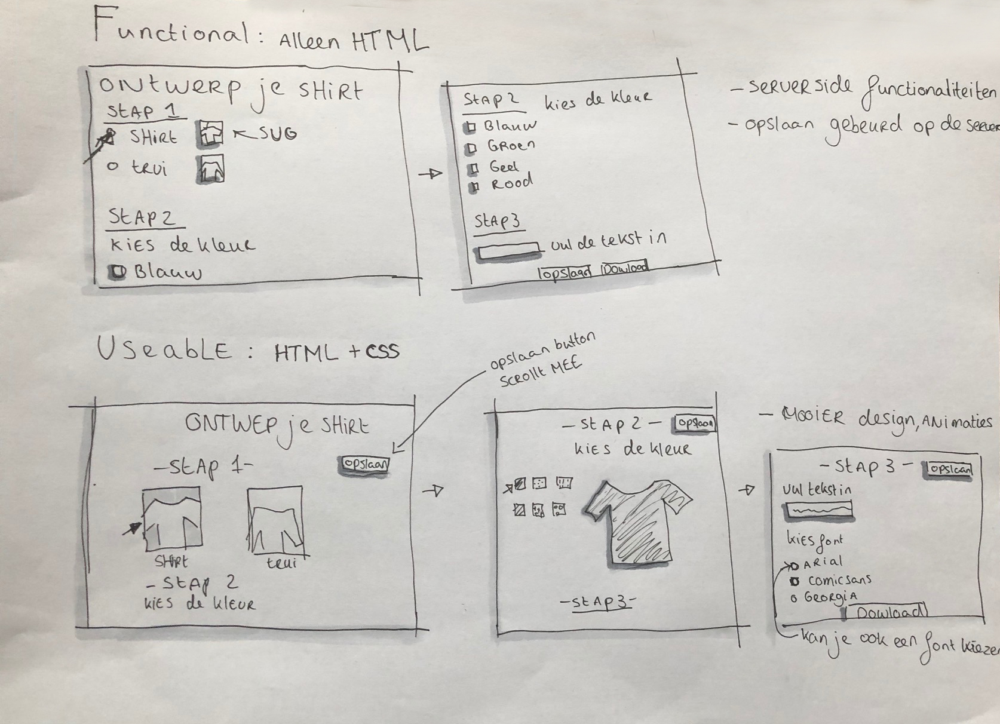
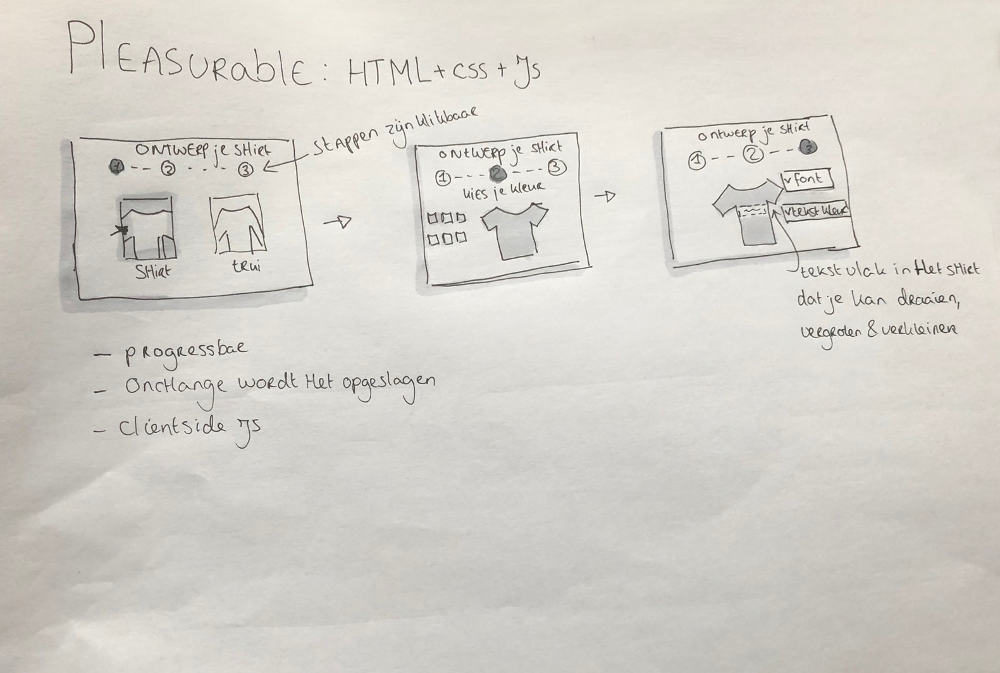

# Browser Technologies @cmda-minor-web 1920

//Robuuste, toegankelijke websites ontwerpen en maken …

## Opdracht 2 - Progressive Enhanced Browser Technologie

# Feedback vrijdag 20 maart

Momenteel ben ik bezig met mijn css only laag(nog niet af). Keuzes die je maakt worden wel al opgeslagen.

1. Ik ben nu bezig om met de radio buttons :checked de shirt previews te laten zien, je kan kiezen uit een trui en een shirt. Nu probeer ik ook nog is de kleur aan te passen. Het selecteren van shirt en trui is gelukt, nu probeer ik ook nog is daarboven op er voor te zorgen dat je van beide de kleur kan aanpassen. Graag hoor ik hoe ik dat het beste kan aanpakken.
2. Bijvoorbeeld bij shirt preview, heeft een screenreader gebruiker geen idee wat hij ziet. Hoe kan ik dat het beste aanpakken? Ik zat zelf te denken om ergens een samenvattende tekst neer te zetten met wat de gebruiker heeft geselecteerd en die dan niet zichtbaar is. Ik vraag mij alleen af of dit de juiste aanpak is
3. Feedback of mijn html semantisch correct is

# Create your own shirt

Mijn case is het ontwerpen van je eigen shirt met tekst, je moet het kunnen printen, opslaan en een volgende keer dat je de site bezoekt kunnen gebruiken.

# wireflow

## functional/usable/pleasurable

- **functional**: De gebruiker moet de meest basic functionaliteit kunnen uitvoeren. In dit geval een kleur uitkiezen en een tekst invoeren voor het shirt.
- **usable**: Css wordt toegevoegd om de ux te verbeteren, gebruiker krijgt feedback wanneer hij iets selecteer. Bijvoorbeeld shirt verandert van kleur als hij een kleur uitkiest.
- **pleasurable**:Gebruiker hoeft niet meer steeds te scrollen, krijgt een progressbar te zien. Kan op het shirt zelf het tekstvlak vergroten, verkleinen & draaien. Opslaan knop is weg, want nu wordt alles onchange opgeslagen.

## to do:

- [ ] Finish css (input types,buttons etc)
- [ ] Achtergrond niet genoeg contrast(andere kleuren samenstelling)
- [ ] nog niet gekekeken naar css fallbacks en in welke browsers wat stuk gaat
- [ ] css radio button trick ook voor de shirt kleuren
