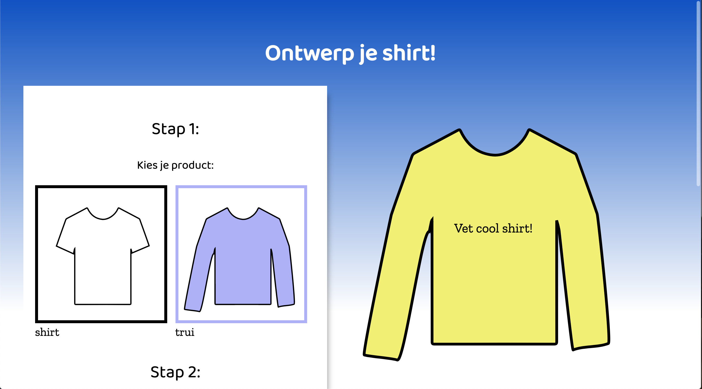
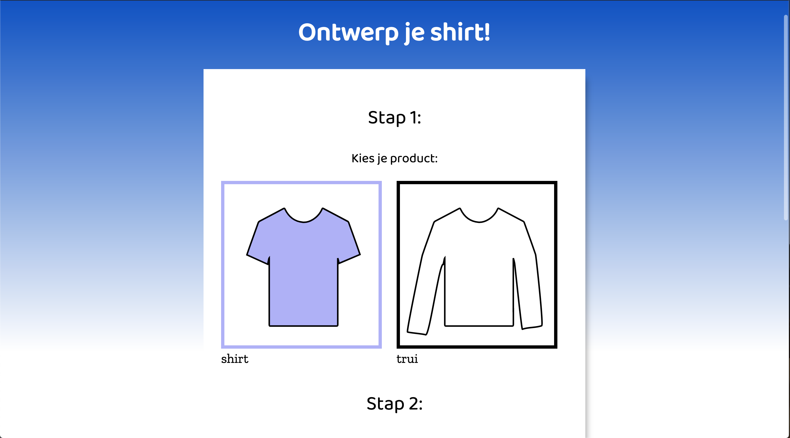
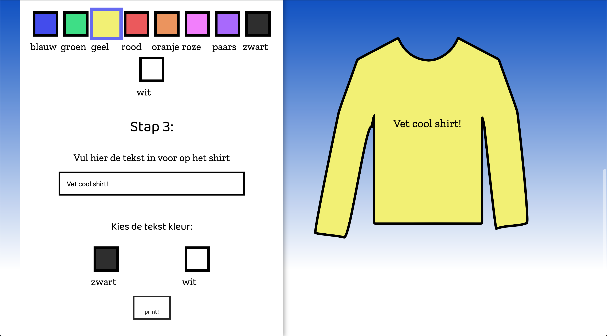

# Browser Technologies @cmda-minor-web 1920

[live demo](https://monikaas-browser-techt.herokuapp.com/). 

# Create your own shirt

Ontwerp je eigen shirt met tekst, je moet het kunnen printen, opslaan en een volgende keer dat je de site bezoekt weer verder kunnen gaan met waar je was gebleven.



## Progressive enhancement

### functional laag


In de functional laag gebruik ik alleen html. Het ziet er niet mooi uit, maar hij werkt in alle browsers!

De gebruiker moet de meest basic functionaliteit kunnen uitvoeren. In dit geval een kleur uitkiezen en een tekst invoeren voor het shirt.


De gebruiker kan ook zijn keuzes op de server op slaan en de preview van zijn samen gestelde shirt bekijken.

### usable laag
In deze laag heb ik css toegevoegd, zodat het voor de gebruiker wat gebruiksvriendelijker wordt. inputs zijn gestijld & css animaties zijn toegevoegd. 

Kwa functionaliteiten werkt het precies nog het zelfde als de functional layer.




### pleasurable laag

Gebruiker krijgt meteen een preview te zien, waneer hij iets selecteerd. Je krijgt ook een printkop te zien, als je er op klikt kan je de pagina uit printen. Opslaan knop is weg, want nu wordt alles onchange opgeslagen in localstorage.

Als localstorage niet gesuport wordt, komt de save knop terug.





## Feature detection

### css

**1. gradients:**

ik maak gebruik van een gradient op de background, [meeste browser ondersteunen dit wel]([https://www.google.com](https://caniuse.com/#feat=css-gradients)). 

Maar als een browser dit niet ondersteunt gebruikt die de fallback naar 1 solide background color.
```css
background-color: rgb(9, 78, 197); /*--fallback--*/
    background-image: linear-gradient(180deg, rgb(9, 78, 197) 0%, rgb(255, 255, 255) 80%);
```

**2. em value:**

Als values maak ik gebruik van em, dit wordt alleen [niet ondersteunt in hele oude browsers zoals IE 8](https://caniuse.com/#search=rem) 

Om het op te lossen kun je een fallback gebruiken die pixels gebruikt als value.

```css
font-size: 20px; /*--fallback--*/
font-size: 1.5em;
```

**3. custom fonts:**

Voor mijn fonts maak ik gebruik van custom fonts [dit wordt bijvoorbeeld niet ondersteunt door oude browser zoals IE 8 of opera mini](https://caniuse.com/#search=%40font-face) 

**4. overig**

Voor de rest maak ik gebruik van **animaties, transforms, svg styling, flexbox, @media print**. 

Dit is puur voor esthetische redenen, dus maakt het niet veel uit als het niet werkt. De site blijft nog steeds functioneel.

### js

**1. es6**

es6 wordt niet door alle [browser ondersteunt](https://caniuse.com/#search=ECMAScript%202015)

ik heb er daarom voor gezorgd dat alle `const` & `let` omgezet zijn naar `var`

**2. window.print()**

window.print() werkt in veel moderne browser prima, maar er zijn nog [veel browsers waar het niet lekker in gesuport wordt](https://caniuse.com/#search=print). 

De code hieronder kijkt of window.print bestaat:

```js
if (typeof window.print != 'undefined') {
        console.log('yeah, we kunnen printen!')
//voeg code toe print
    } else {
        console.log('print functie doet t niet')
        //voeg code(text) toe die uitlegt hoe de gebruiker wel kan printen
    }
```

**3. window.localstorage**

Localstorage wordt in [hele oude browsers zoals IE 8 niet ondersteunt](https://caniuse.com/#search=localstorage), maar een gebruiker kan dit ook uitgezet hebben. 

Omdat op te lossen kijk ik of de gebruiker localstorage aan heeft staan en als het bestaat, worden de geselecteerde keuzes toegevoegd:


```js
try { // dit stuk heb ik van:  https://developer.mozilla.org/en-US/docs/Web/API/Web_Storage_API/Local_storage
        var storage = window['localStorage'],
            x = '__storage_test__'
        storage.setItem(x, x)
        storage.removeItem(x)
        return true
    } catch (e) {
        return e instanceof DOMException && (
                // everything except Firefox
                e.code === 22 ||
                // Firefox
                e.code === 1014 ||
                // test name field too, because code might not be present
                // everything except Firefox
                e.name === 'QuotaExceededError' ||
                // Firefox
                e.name === 'NS_ERROR_DOM_QUOTA_REACHED') &&
            // acknowledge QuotaExceededError only if there's something already stored
            storage.length !== 0
    }
}

if (storageAvailable('localStorage')) {
    console.log('Yippee! We can use localStorage awesomeness')
//als er localstorage is voeg de items toe en haal t op
} else {
    console.log('Too bad, no localStorage for us')
    //als er geen localstorage is voeg de save button aan het design toe

}
```


## Accesibility

Hieronder mijn audit op accesibility:


**1. kleuren blindheid**

Als je bijvoorbeeld een kleurenblindheid voor blauw hebt, kun je uit het onderstaande voorbeeld het verschil tussen bepaalde kleuren niet goed zien.

Om dit op te lossen heb ik de labels van de kleurvlakken zichtbaar gehouden.


Ik heb ook geprobeerd om voor zoveel mogelijk contrast te zorgen in de selecties. Mocht een geslecteerd element in de border niet genoeg contrast bieden, heb ik het element ook nog een stukje groter gemaakt.


**2. keyboard only**

Om elementen selecterbaar te maken op een keyboard moet je er voor zorgen dat je html semantisch correct is. Ik heb voor selecteerbare elementen alleen maar gebruik gemaakt van `input types` & `buttons`

belangrijk is om custom geselecteerd input elementen met `:focus` te stijlen, zo zie je ook wat je geselecteerd en het maakt de ervaring prettiger om naar te kijken.

**3. screen reader**

Als je alles semantische correct hebt geschreven, moet het voor screenreaders geen probleem zijn om je pagina uit te lezen.

Let alleen wel op met hoe je bepaalde dingen omschrijft. Voor screenreader gebruikers is bijvoorbeeld de tekst: 

`Kies de kleur:` 

niet duidelijk genoeg.

dat heb ik aangepast naar:

`Kies de kleur van het product:` &
` Kies de tekst kleur:`

Voeg bijvoorbeeld ook een `html lang` attribute toe, zo kan de screenreader zien welke taal de tekst is geschreven.

## wireflows


## To do/wishlist

- [ ] tekst kunnen verkleinen, vergroten etc.
- [x] printen
- [x] kleur veranderen van de preview
- [ ] fixen dat je de preview ook alleen met css kan zien
- [ ] Voor screen reader gebruikers een optie toevoegen om een lijstje te horen met wat allemaal geselecteerd is
- [x] tekst kleur aanpassen
- [x] tekst toevoegen
- [x] meer contrast toevoegen